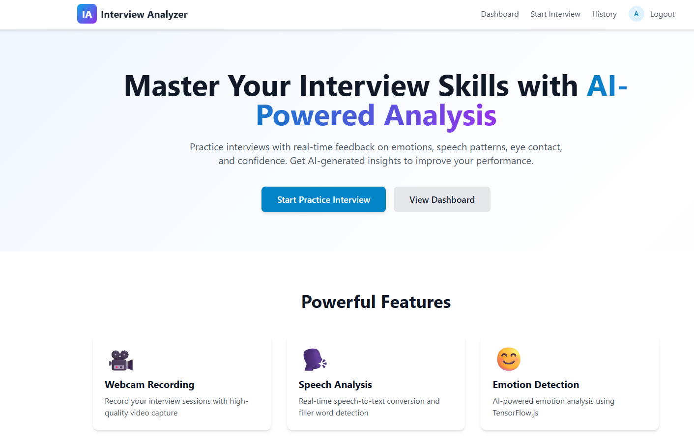
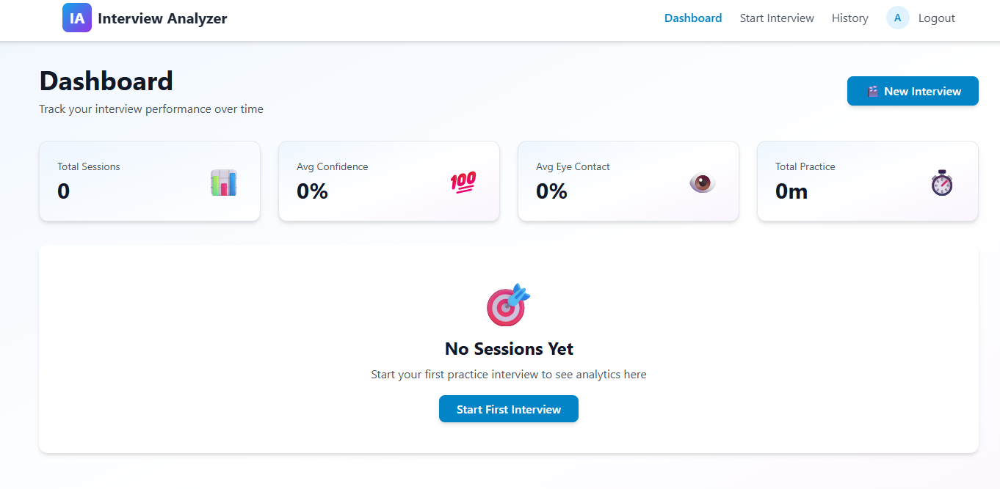
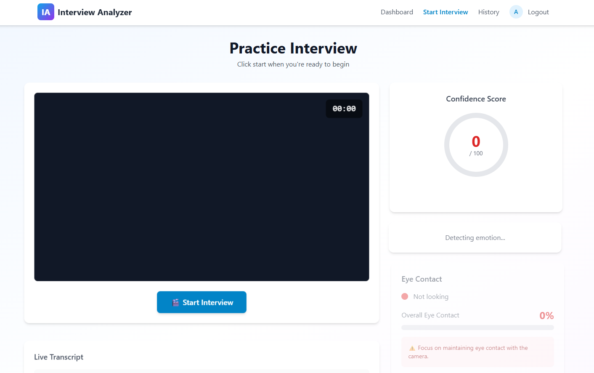

# AI Interview Emotion Analyzer 🎭🤖

An AI-powered web application that analyzes a candidate’s emotions during mock interviews using facial expression detection and provides real-time emotional insights to improve interview performance.

---

## Screenshots

### Landing page


### Dashboard


### Session


### History


## 🚀 Features

- 🎥 Real-time webcam-based emotion detection
- 😀 Detects emotions like:
  - Happy
  - Sad
  - Angry
  - Neutral
  - Fear
  - Surprise
- 📊 Displays live emotion analysis results
- 🧠 AI-powered facial expression recognition
- 💻 Interactive and user-friendly interface
- 📈 Helps users improve interview confidence and communication skills

---

# 🛠️ Technologies Used

| Technology | Purpose |
|---|---|
| HTML | Structure |
| CSS | Styling |
| JavaScript | Frontend Logic |
| Python | Backend Processing |
| Flask | Web Framework |
| OpenCV | Video Capture & Image Processing |
| DeepFace / FER | Emotion Detection |
| NumPy | Numerical Operations |

---

# 📂 Project Structure

```bash
AI-Interview-Emotion-Analyzer/
│
├── static/
│   ├── css/
│   │   └── style.css
│   │
│   ├── js/
│   │   └── script.js
│   │
│   └── images/
│
├── templates/
│   └── index.html
│
├── model/
│   └── emotion_model.h5
│
├── app.py
├── requirements.txt
├── README.md
└── .gitignore
```

---

# ⚙️ Installation

## 1️⃣ Clone the Repository

```bash
git clone https://github.com/Apoorva-Nayak07/AI-Interview-Emotion-Analyzer.git
```

---

## 2️⃣ Navigate to Project Folder

```bash
cd AI-Interview-Emotion-Analyzer
```

---

## 3️⃣ Create Virtual Environment (Optional)

### Windows

```bash
python -m venv venv
venv\Scripts\activate
```

### Linux / Mac

```bash
python3 -m venv venv
source venv/bin/activate
```

---

## 4️⃣ Install Dependencies

```bash
pip install -r requirements.txt
```

---

## 5️⃣ Run the Application

```bash
python app.py
```

---

# 🌐 Open in Browser

```bash
http://127.0.0.1:5000/
```

---

# 🧠 How It Works

1. User opens the web application
2. Webcam captures live video feed
3. Frames are processed using OpenCV
4. AI model detects facial emotions
5. Detected emotion is displayed in real-time
6. User gets emotional performance insights

---

# 📸 Screenshots

## Home Page

```bash
(Add Screenshot Here)
```

## Emotion Detection Output

```bash
(Add Screenshot Here)
```

---

# 📦 Requirements

Example dependencies:

```txt
Flask
opencv-python
numpy
deepface
tensorflow
keras
```

---

# 🎯 Future Enhancements

- 🎙️ Voice emotion analysis
- 📑 Interview performance report generation
- ☁️ Cloud deployment
- 🧑‍💼 AI-based interview feedback
- 📈 Emotion analytics dashboard
- 🔐 User authentication system

---

# 👨‍💻 Authors

## Apoorva Nayak

- GitHub: [Apoorva-Nayak07](https://github.com/Apoorva-Nayak07)

---

# 🤝 Contributing

Contributions are welcome!

1. Fork the repository

2. Create a new branch

```bash
git checkout -b feature-name
```

3. Commit your changes

```bash
git commit -m "Added new feature"
```

4. Push to GitHub

```bash
git push origin feature-name
```

5. Create Pull Request

---

# 📜 License

This project is developed for educational and learning purposes.

---

# ⭐ Support

If you like this project:

- ⭐ Star the repository
- 🍴 Fork the project
- 📢 Share with others

---

# 📬 Contact

## Apoorva Nayak

- GitHub: [GitHub Profile](https://github.com/Apoorva-Nayak07)

---

> “AI can analyze expressions, but confidence comes from practice.” 🚀
